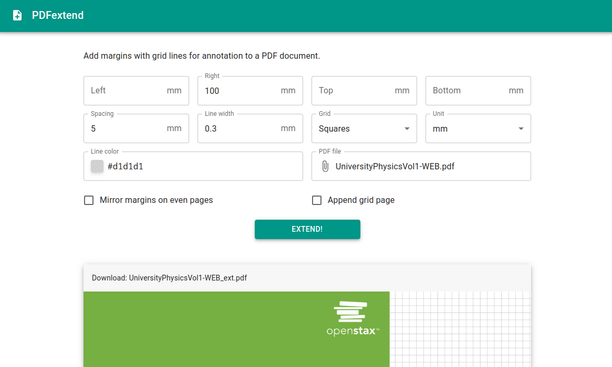

# PDFextend

PDFextend is a tool to add margins with grid lines for annotation to a PDF document.
These additional margins provide extra space for annotations in apps without infinite canvas (i.e. almost all of them: Notability, Flexcil, Xournal++, etc.).
This can be useful when studying research papers or text books.
The background of generated margins is configurable (empty, horizontal lines, square grid, dots).

PDFextend is available as [web app](https://pdfextend.pages.dev/) (installable as PWA) or command line tool.



## Tech

- Core and CLI in Rust.
- [PDFium](https://pdfium.googlesource.com/pdfium/+/master/README.md) for PDF processing using the [pdfium-render](https://github.com/ajrcarey/pdfium-render) crate.
- Web app with [MUI](https://mui.com/).
- Rust code compiled to WASM and used in web worker.

## CLI Usage

```
Usage: pdfextend [OPTIONS] <INPUT> <OUTPUT>

Arguments:
  <INPUT>   Path to input PDF file
  <OUTPUT>  Path to output PDF file

Options:
  -l, --left <LEFT>              Extend document by <LEFT> to the left [default: 0]
  -r, --right <RIGHT>            Extend document by <RIGHT> to the right [default: 0]
  -t, --top <TOP>                Extend document by <TOP> to the top [default: 0]
  -b, --bottom <BOTTOM>          Extend document by <BOTTOM> to the bottom [default: 0]
  -s, --spacing <SPACING>        Spacing between grid lines [default: 5 mm]
  -w, --line-width <LINE_WIDTH>  Line width [default: 0.1 mm for lines, 0.7mm for dots]
  -u, --unit <UNIT>              Unit of the numeric parameters (pt = in/72) [default: mm] [possible values: mm, cm, in, pt]
  -g, --grid <GRID>              Add grid to the extended margins [possible values: lines, squares, dots]
  -e, --extra-page               Append an additional page with grid to the document
  -m, --mirror                   Swap <LEFT> and <RIGHT> for even pages
  -c, --color <COLOR>            Color of the grid lines (format: #A0B0C0 or #ABC for RGB, #A0 or #A for grayscale, # is optional) [default: #F0F0F0]
  -h, --help                     Print help information
  -V, --version                  Print version information
```

## Building

### CLI

```sh
cd pdfextend-cli
./getpdfium.sh  # NOTE: assumes Linux x64
cargo build --release
```

### Web

```sh
cd pdfextend-web
wasm-pack build --target no-modules
cp pkg/pdfextend_web{.js,_bg.wasm} ../webapp/public
cd ../webapp
npm install
npm run build
npx wrangler pages publish dist
```

### License compilation

```sh
cd licenses/
python license_aggregator.py > ../webapp/src/license.md
python license_aggregator.py > out.md
cat header.md out.md > out2.md
pandoc out2.md --pdf-engine=xelatex -o ../webapp/public/license.pdf
```
